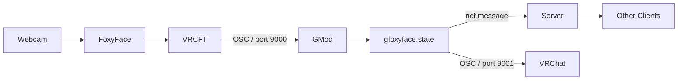

# GFoxyFace

Garry's Mod ↔ VRCFaceTracking bridge using OSC over UDP.

> **⚠ WIP — Work in Progress.** Everything is subject to change. Use at your own risk.

## Install

**Install these:**
1. **[VRCFaceTracking](https://store.steampowered.com/app/3329480/VRCFaceTracking/)** — Install from Steam. This receives data from your face-tracking hardware and forwards it as OSC.
2. **[FoxyFace](https://foxyface.jeka8833.pp.ua/docs/FoxyFace/install-update-uninstall/install/Install-FoxyFace/)** — Install and configure FoxyFace so it can relay tracking data to VRCFT above.
3. **Garry's Mod luasocket** (good luck)

**Then:**

Copy the addons folder (or subscribe to workshop if we ever bother uploading this there, good luck).

## Usage

| ConVar | Default | Description |
|--------|---------|-------------|
| `gfoxyface_autoenable` | 1 | Auto-start sending face data |
| `gfoxyface_listen_port` | 9000 | UDP port to receive VRChat OSC |
| `gfoxyface_send_port` | 9001 | UDP port to send OSC to VRChat |
| `gfoxyface_debug_ui` | 0 | Show real-time parameter overlay |
| `gfoxyface_see_others` | 1 | Receive other players |

| Command | Description |
|---------|-------------|
| `gfoxyface_start` | Start the OSC listener |
| `gfoxyface_stop` | Stop the OSC listener |

## Developers: data flow

