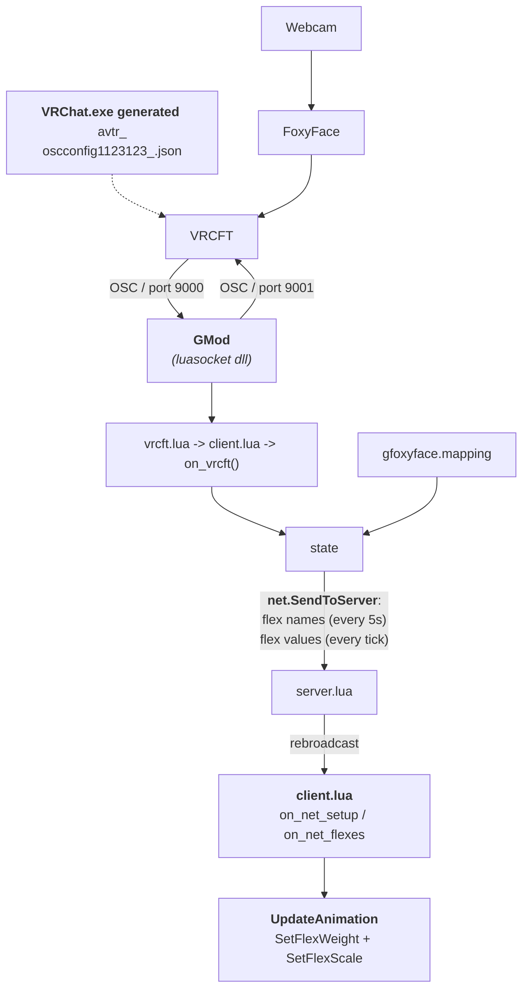

# GFoxyFace

Garry's Mod ↔ VRCFaceTracking bridge using OSC over UDP.

> **⚠ WIP — Work in Progress.** Everything is subject to change. Use at your own risk.


## Install

**Install these:**
1. **[VRCFaceTracking](https://store.steampowered.com/app/3329480/VRCFaceTracking/)** — Install from Steam. This receives data from your face-tracking hardware and forwards it as OSC.
2. **[FoxyFace](https://github.com/Jeka8833/FoxyFace)** — Install and configure FoxyFace so it can relay tracking data to VRCFT above. ([Install Guide](https://foxyface.jeka8833.pp.ua/docs/FoxyFace/install-update-uninstall/install/Install-FoxyFace/))
3. **Garry's Mod luasocket** (good luck)

**Then:**

Subscribe on the Steam Workshop: [GFoxyFace](https://steamcommunity.com/sharedfiles/filedetails/?id=282498239)

## Usage

| ConVar | Default | Description |
|--------|---------|-------------|
| `gfoxyface_autoenable` | 0 | Auto-start OSC listener on join |
| `gfoxyface_listen_port` | 9000 | UDP port to receive VRChat OSC |
| `gfoxyface_send_port` | 9001 | UDP port to send OSC to VRChat |
| `gfoxyface_debug_ui` | 0 | Show 2D real-time parameter overlay |
| `gfoxyface_debug_ui_3d` | 0 | Show 3D debug overlay on other players |
| `gfoxyface_debug_loopback` | 0 | Receive and apply your own relayed tracking data (debugging) |
| `gfoxyface_see_others` | 1 | Receive and animate other players' tracking data |

| Command | Description |
|---------|-------------|
| `gfoxyface_start` | Start the OSC listener |
| `gfoxyface_stop` | Stop the OSC listener |
| `gfoxyface_request_tracking_vrcft` | Send avatar change + tracking enable OSC to VRChat |
| `gfoxyface_status` | Print current status, mappings, and model flexes |

## Requesting tracking from VRCFT

VRCFT only sends OSC data while you're in a VRChat avatar that requests face tracking. To get data outside VRChat (e.g. in GMod), `gfoxyface_request_tracking_vrcft` sends two OSC messages to VRCFT on port 9001:

1. `/avatar/change avtr_3efe552c-3f33-4eff-b360-26ccb5c925a1` 
2. `/avatar/parameters/LipTrackingActive true` and `/avatar/parameters/EyeTrackingActive true`
This triggers VRCFT to start forwarding face-track data to GMod via OSC on port 9000.

> **Note:** This sends OSC to VRCFT as if it came from VRChat. It's a hack — VRCFT doesn't verify the sender, so it accepts the commands. You don't need VRChat running for this to work.

### One-time setup: equip the avatar in VRChat

Before the OSC hack works, you need to have **loaded the avatar in VRChat at least once**. VRCFT won't forward tracking data for avatars it hasn't seen.

1. Install **[VRChat](https://store.steampowered.com/app/438100/VRChat/)** on Steam.
2. Wear the avatar: [HQ Meta-man](https://vrchat.com/home/avatar/avtr_3efe552c-3f33-4eff-b360-26ccb5c925a1)
3. Enable OSC from circle menu settings!!!
4. Close VRChat. The avatar osc config is now cached.

### Manual config copy

If you REALLY don't want to install VRChat (helps debug VRCFT):

Copy `avtr_3efe552c-3f33-4eff-b360-26ccb5c925a1.example.json` (included in this repo) to:

```
C:\Users\<YourUser>\AppData\LocalLow\VRChat\VRChat\OSC\usr_<your_usr_id>\Avatars\
```

(Keep the filename `avtr_3efe552c-3f33-4eff-b360-26ccb5c925a1.json`, find your `usr_<id>` folder inside `OSC\` — it's created once you enable OSC in VRChat.)

## Developers: data flow


